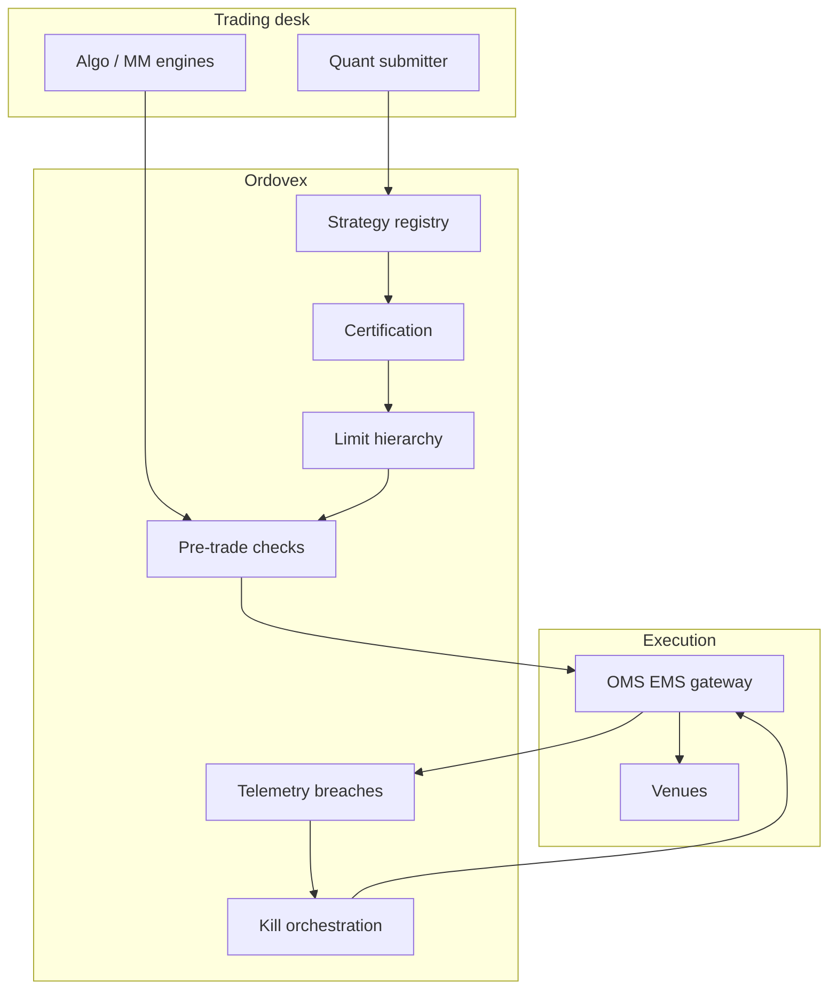

# Ordovex

**Source:** `ai-in-financial/Artificial-Intelligence-Financial-Sector/`
**Domain:** `ai-fin`
**One-liner:** A pre-trade and intraday risk-control plane for algorithmic and ai-assisted trading desks that certifies strategies, enforces limits, and kills runaway models before they become market-conduct or capital events.
**Wedge:** Tier-1 and regional bank / prop algorithmic trading and market-making desks (equities, FX, listed derivatives) that already run ML signal overlays or automated market-making and need firm-wide kill switches, limit hierarchies, and strategy certification—not another alpha research notebook.
**Positioning:** Trading risk controls for the AI era. The UCG sector brief ranks “algorithmic trading strategy performance improvement” among the top cumulative AI use-case revenue segments worldwide (~$6.4B 2016–2025) while warning banks still leave most data unused and face implementation challenges; Ordovex monetises the control gap between that spend and safe deployment. Distinct from Veltara (retail advice governance) and Settora (post-trade shared state).

## Market research synthesis

### Thesis from source

The October 2018 UCG brief on AI effects in financial services frames AI as cognitive automation, engagement, and insight, and documents explosive market growth (global AI market revenues rising from roughly $3.2B in 2016 toward ~$90B by 2025 on cited Statista/Tractica series). Within top use cases, algorithmic trading strategy performance improvement appears alongside cybersecurity prevention and document digitisation as a major cumulative revenue segment. Banking drivers include computing power (claimed as ~80% of recent AI advances), data growing ~40% toward 44 trillion gigabytes by 2020, and rising corporate VC.

In banking applications the brief highlights anti-fraud and risk (real-time anomaly sensing feeding transaction monitoring and KYC), credit underwriting, and automation of client interaction—with Saudi-specific notes that 83% of the population uses messaging apps and over 70% of bank consumers are digitally self-directed or multichannel. Wealth and markets examples include Kensho-style event correlation Q&A, BlackRock Aladdin’s trade-fail prediction and NLP over broker reports, Sqreem deep-learning digital-activity models, and Bridgewater’s push to automate firm decisioning. Challenges in 2018 remain nascent-stage: implementation issues, talent, data quality, and organisational readiness—exactly where uncontrolled algo rollout fails.

The product wedges on the markets desk: AI improves strategy performance, but without certified limits, model versioning, market-impact budgets, and hierarchical kill switches, “performance improvement” is indistinguishable from operational risk. Ordovex is the control plane that lets desks ship AI overlays under documented risk appetite.

### Buyer & economic model

- **Primary buyer:** Head of Market Risk or Head of Electronic Trading / Market Making at a bank or prop firm.
- **Users:** desk heads, algo traders, quant researchers (submitters), market risk officers, compliance/market conduct, platform SREs for trading infra.
- **Budget owner / value metric:** market-risk and trading P&L. Value metric is limit-breach avoidance, time-to-kill for defective strategies, and share of AI/algo notional running under certified controls.
- **Competing status quo:** spreadsheet limit books; per-desk homegrown killers; OMS max-order checks without strategy-level AI model identity; post-incident War Rooms.

### Domain constraints

- **Regulatory / trust / safety:** market-abuse and algo-trading controls (e.g. kill switch, testing, capacity), best execution, model risk management expectations, capital and stress overlays.
- **Data sensitivity:** strategies and order intents are highly confidential IP; multi-desk tenancy must prevent cross-desk leakage.
- **Change-management realities:** desks resist friction that slows alpha deployment; Ordovex must certify fast for low-risk changes and slow only when risk class demands it.

## Business requirements

- BR-1: No AI or algorithmic strategy may trade live notional without a certified risk package (limits, markets, max loss, messaging rates) bound to a model/strategy version.
- BR-2: Hierarchical limits (firm → desk → strategy → symbol) must be enforceable in real time, with the tightest applicable limit winning.
- BR-3: A firm-wide and desk-level kill switch must halt new orders and optionally cancel working orders for a strategy within a published SLA (seconds, not tickets).
- BR-4: Strategy certification must record backtest/simulation evidence status, owner, and approver; uncertified strategies cannot be promoted.
- BR-5: Intraday P&L, drawdown, and message-rate breaches must auto-throttle or kill according to policy, not wait for human chat.
- BR-6: Market-making strategies must declare quoting obligations and inventory skew limits as first-class controls.
- BR-7: All automated actions (throttle, kill, limit tighten) must be immutable and attributable for market-conduct reconstruction.
- BR-8: Model version rollback must be one action with immediate effect on live bindings.
- BR-9: Risk officers must see aggregate AI/algo notional and concentration by factor or crowded signal family.
- BR-10: Change windows and dual control must apply to raising limits; lowering or killing must not require dual control delays.
- BR-11: Integration must work with existing OMS/EMS—Ordovex is a control plane, not a replacement matching engine.
- BR-12: Post-incident packs must reconstruct strategy version, limits, signals, and kill timeline for regulators and insurers.

## User stories

Canonical user stories live in sibling [USER_STORIES.md](USER_STORIES.md).

## System design

### Overview

Ordovex registers strategies and model versions, binds certified limit packages, evaluates pre-trade and intraday telemetry against hierarchies, and issues throttle/kill/cancel instructions to OMS/EMS gateways. Certification workflow and incident reconstruction sit beside the hot path but share the same identity of what is allowed to trade.

### Actors & boundaries

- **Actors:** quant submitter, desk head, market risk, conduct, SRE, OMS/EMS.
- **Trust boundary:** Ordovex decisions are authoritative for the firm’s algo gateway; desks cannot disable firm limits. Strategy IP stays within firm tenancy.
- **Human-in-the-loop points:** certification approval; limit raises; post-kill restart authorisation.

### Core capabilities

1. **Strategy and model registry** — versions, owners, markets, AI/rules classification.
2. **Certification workflow** — evidence, approvers, risk class.
3. **Limit hierarchy** — firm/desk/strategy/symbol including MM inventory skew.
4. **Pre-trade checks** — reject orders outside envelope.
5. **Intraday telemetry and breach actions** — throttle, kill, cancel.
6. **Kill-switch orchestration** — desk and firm scopes.
7. **Concentration and crowded-signal monitors**.
8. **Incident reconstruction packs**.

### Conceptual data

- **Primary entities:** Strategy, ModelVersion, Certification, LimitPackage, LimitHierarchyNode, OrderIntentCheck, TelemetrySnapshot, BreachAction, KillOrder, IncidentPack.
- **Critical events:** version submitted, certified, limit changed, pre-trade reject, breach, kill, restart authorised, pack exported.
- **Retention / audit needs:** certifications, limit changes, kills retained for market-conduct and model-risk windows; high-frequency telemetry aggregated after short hot retention.

### Integrations (conceptual)

- **Systems of record:** OMS/EMS, market-risk engines, position keeping, model inventory.
- **Upstream signals:** strategy PnL/fill/message telemetry, market data volatility regimes, venue reject codes.
- **Downstream actions:** order rejects, cancels, desk alerts, incident tickets, regulatory packs.

### High-level architecture

### Success metrics

- **Leading:** % of live algo notional under certified packages; mean time to kill; pre-trade reject rate outside envelope; certification cycle time by risk class.
- **Lagging:** severe algo incidents per year; market-conduct findings; capital/operational loss from runaway strategies; desk adoption (% strategies enrolled).

## OpenAPI skeleton

Canonical HTTP surface lives in sibling [openapi.yaml](openapi.yaml). Summary:

- **Base path:** `/v1/...`
- **Auth:** `X-API-Key` for OMS/telemetry gateways; Bearer JWT for risk and desk operators.
- **Resource groups:** Strategies, Certifications, Limits, PreTrade, Telemetry, Kills, Incidents.
