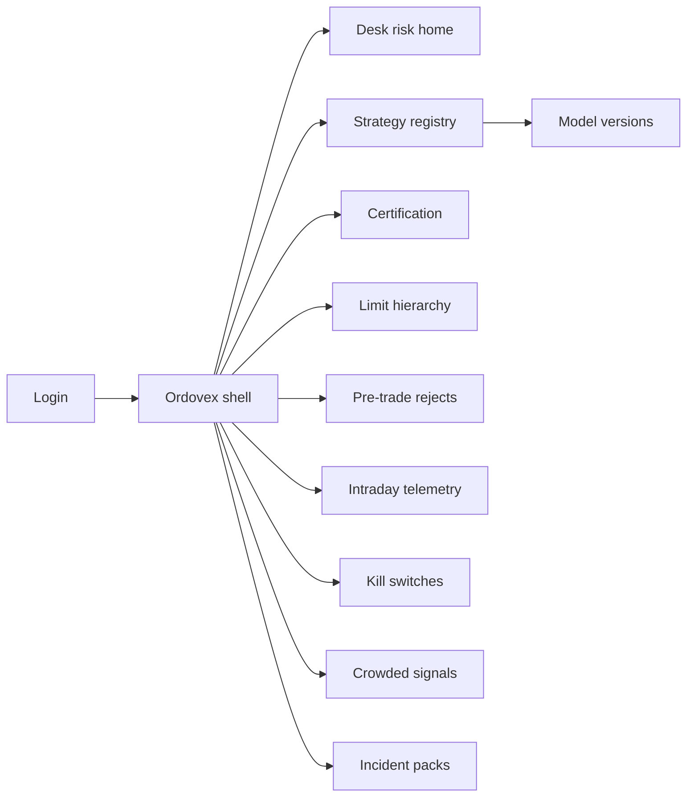
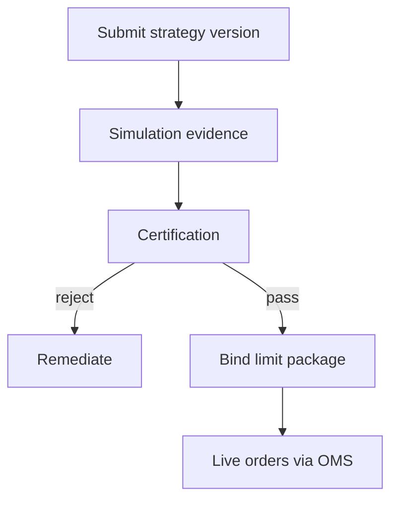
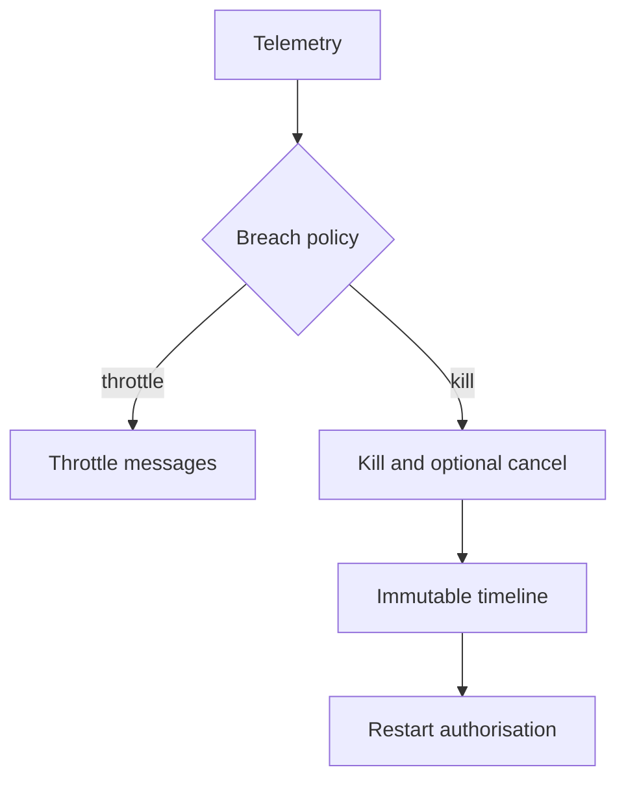

# Ordovex — Web app

**Product:** [PRODUCT.md](./PRODUCT.md)
**Primary surface:** Pre-trade and intraday algo risk-control plane (certification + limit hierarchy + kill orchestration)
**Secondary surfaces:** Incident reconstruction pack viewer (read-only); OMS gateway health strip (ops read-only)
**Design thesis:** Ordovex is the firm’s algo circuit breaker—not a research notebook, not retail advice governance (Veltara), and not a post-trade ledger. The metaphor is a reactor control room: near-black ground, phosphor-green live telemetry, amber throttle, and hard-red kill that drops in seconds. Strategies trade only with a certified risk package bolted on like a containment vessel; hierarchical limits stack as nested rings (firm → desk → strategy → symbol). The Ordovex wordmark is phosphor-green on every live control so desks never confuse alpha tools with the authority that can stop them.

## UX research synthesis

### Category peers (best-in-class)

- **Trading Technologies / Fidessa risk modules:** Desk-level limits and panic buttons. Steal: hierarchical limit visualization and one-click desk kill (BR-2, BR-3); reject spreadsheet limit books as system of record.
- **Nasdaq / exchange kill-switch operator UIs:** Seconds-scale halt and cancel working orders. Steal: published SLA chrome and immutable kill timeline (BR-3, BR-7); reject ticket-queue “please kill” workflows.
- **BlackRock Aladdin risk (markets):** Aggregate exposure and fail prediction adjacent to trading. Steal: concentration / crowded-signal views (BR-9); reject portfolio-management sprawl as Ordovex home.
- **FlexTrade / OMS pre-trade risk:** Order reject outside envelope. Steal: pre-trade check results bound to strategy version (BR-1); Ordovex remains control plane, not matching engine (BR-11).

### Patterns to adopt / reject

- **Adopt:** Certification before live notional; tightest-limit-wins hierarchy; auto-throttle on drawdown/message rate; kill without dual-control delay; dual control only on limit raises; incident packs; model rollback one action.
- **Reject:** Veltara suitability parlour chrome; Signal/Telegram aesthetics; notebook-first home; editable kill history; slow dual-approve on emergency kill.

### Trust, density, and workflow constraints from PRODUCT.md

Desks resist friction—fast certify for low-risk changes, slow only when risk class demands. Multi-desk tenancy must prevent cross-desk strategy IP leakage. Lowering/killing must not wait on dual control (BR-10); raising limits must.

## Information architecture

### Nav model

### Roles → default home

| Role | Default home | Why |
|------|--------------|-----|
| Head of electronic trading | Desk risk home | Certified notional + desk kill |
| Quant researcher | Strategy registry / cert submit | Structured review (BR-4) |
| Market risk officer | Limit hierarchy + telemetry | Firm appetite real (BR-2, BR-5) |
| Market conduct | Incident packs + kill timeline | Reconstruction (BR-7, BR-12) |
| Trading platform SRE | Kill APIs health + latency | Control plane not silent fail |

### Cross-links to OpenAPI resources

| Nav area | OpenAPI tags / resources |
|----------|---------------------------|
| Strategies / versions | Strategies |
| Evidence and approvals | Certifications |
| Firm/desk/strategy/symbol | Limits |
| Envelope rejects | PreTrade |
| PnL / drawdown / msg rate | Telemetry |
| Halt / cancel | Kills |
| Reconstruction | Incidents |

## Screen inventory

### Desk risk home

- **Purpose:** Answer “what AI/algo notional is live under certified controls, and can I kill it now?”
- **Entry:** Desk head / e-trading default.
- **Layout regions:** Phosphor KPI strip (certified notional %, open breaches); strategy heat list; desk kill button; control-plane latency health.
- **Primary actions:** Desk kill; open breach; open uncertified hot attempt alert.
- **Empty / loading / error:** Empty = enroll first strategy; latency degrade = SRE banner.
- **BR / story ties:** Head of e-trading stories; BR-1, BR-3.

### Strategy and model registry

- **Purpose:** Versions, owners, markets, AI/rules class—IP scoped to desk tenancy.
- **Entry:** Quant default.
- **Layout regions:** Strategy table; version tree; live binding chip; cross-desk isolation indicator.
- **Primary actions:** Submit version; request cert; rollback live binding.
- **Empty / loading / error:** Cross-desk peek denied silently with audit.
- **BR / story ties:** BR-8; quant stories.

### Certification workflow

- **Purpose:** Backtest/simulation evidence, owner, approver; uncertified cannot promote.
- **Entry:** From version submit; risk review queue.
- **Layout regions:** Evidence status; risk class; requested LimitPackage; reject reasons; approver rail.
- **Primary actions:** Approve; reject with reasons; fast-path low-risk; slow-path high-risk.
- **Empty / loading / error:** Missing evidence blocks (BR-4).
- **BR / story ties:** BR-4; quant reject-reason story.

### Limit hierarchy editor

- **Purpose:** Firm → desk → strategy → symbol; tightest wins; MM inventory skew first-class.
- **Entry:** Market risk default.
- **Layout regions:** Nested ring diagram; limit table; MM quoting obligations / skew; raise vs lower affordances (dual control on raise only).
- **Primary actions:** Tighten now; propose raise (dual); simulate tightest-wins.
- **Empty / loading / error:** Conflict highlight when desk tries to exceed firm.
- **BR / story ties:** BR-2, BR-6, BR-10.

### Pre-trade reject monitor

- **Purpose:** Orders outside certified envelope rejected with strategy version attribution.
- **Entry:** From OMS feeds; desk home.
- **Layout regions:** Reject stream; envelope rule hit; strategy version; rate spikes.
- **Primary actions:** Open strategy; tighten limit; investigate malfunction.
- **Empty / loading / error:** Healthy = low reject with last-hit age.
- **BR / story ties:** BR-1; SRE integration.

### Intraday telemetry and auto-actions

- **Purpose:** PnL, drawdown, message-rate breaches auto-throttle or kill per policy.
- **Entry:** Risk officer; desk wallboard.
- **Layout regions:** Live charts; breach thresholds; auto-action log; human override (audited, not silent disable).
- **Primary actions:** Acknowledge; force kill; adjust throttle policy (controlled).
- **Empty / loading / error:** Telemetry gap = treat as risk (amber).
- **BR / story ties:** BR-5.

### Kill-switch console

- **Purpose:** Firm and desk kills—halt new orders, optionally cancel working—within SLA seconds.
- **Entry:** Panic affordance everywhere live; compliance.
- **Layout regions:** Scope selector (firm/desk/strategy); cancel-working toggle; SLA timer; immutable timeline preview; restart auth (separate, dual).
- **Primary actions:** Kill now (no dual delay); authorize restart later.
- **Empty / loading / error:** Kill API fail = page SRE immediately (BR-3, BR-7).
- **BR / story ties:** BR-3, BR-10.

### Crowded-signal concentration

- **Purpose:** Aggregate AI/algo notional by factor / crowded signal family.
- **Entry:** Risk officer.
- **Layout regions:** Concentration matrix; correlated strategy groups; limit implications.
- **Primary actions:** Alert desk; propose diversify / tighten; export.
- **Empty / loading / error:** Unclassified signals = coverage gap banner (BR-9).
- **BR / story ties:** BR-9.

### Model version rollback

- **Purpose:** One action immediate effect on live bindings.
- **Entry:** Registry; incident.
- **Layout regions:** Current vs prior; binding list; confirm; post-rollback cert state.
- **Primary actions:** Rollback now; kill if rollback unsafe.
- **Empty / loading / error:** No prior certified version = kill-only path (BR-8).
- **BR / story ties:** BR-8.

### Incident reconstruction pack

- **Purpose:** Strategy version, limits, signals, kill timeline for regulators/insurers.
- **Entry:** Conduct; post-mortem.
- **Layout regions:** Timeline; artefacts; export hash; OMS correlation ids.
- **Primary actions:** Generate pack; share read-only.
- **Empty / loading / error:** Missing telemetry slices listed (BR-12).
- **BR / story ties:** BR-7, BR-12.

### Control-plane health

- **Purpose:** Ordovex latency and kill API health so the control plane cannot silently fail.
- **Entry:** SRE default slice.
- **Layout regions:** p99 decision latency; kill success rate; gateway heartbeats.
- **Primary actions:** Page; degrade mode policy view.
- **Empty / loading / error:** Degraded = desk home banner.
- **BR / story ties:** SRE stories.

## Key flows

1. **Certify then trade** — submit version + evidence + limits → certify → bind package → pre-trade allows → live; failure: uncertified blocked.

2. **Intraday breach** — telemetry breach → auto-throttle or kill → immutable log → optional restart auth (BR-5, BR-3).

3. **Limit raise** — propose higher limit → dual control → apply; tighten/kill skips dual delay (BR-10).

4. **Crowded signal response** — concentration alert → desk notify → tighten or diversify (BR-9).

5. **Post-incident pack** — select window/strategy → reconstruct → export (BR-12).

## Design system

### Tokens (CSS variables)

- `--color-ink: #D7F5D0` — phosphor text
- `--color-void: #050605` — app ground
- `--color-panel: #0C100C` — panels
- `--color-phosphor: #39FF14` — live / brand (controlled neon, desk-authentic)
- `--color-amber-throttle: #F0A202` — throttle
- `--color-kill: #FF0033` — kill
- `--color-steel: #6B7280` — certified idle
- `--font-display: "IBM Plex Sans", sans-serif`
- `--font-mono: "IBM Plex Mono", monospace` — strategy ids, timestamps
- `--space-1`…`--space-8`: 4px scale
- `--radius-sm: 2px`; `--radius-md: 4px` — sharp control room
- `--motion-kill: 120ms ease-in` — red bar drop
- `--motion-throttle: 160ms ease-in-out` — amber pulse
- `--motion-live: 200ms linear` — phosphor tick
- Atmosphere: CRT scanline hint at 3% opacity; nested limit rings as subtle background motif; no purple; no retail wealth parlour gold.

### Typography & brand

- Plex for dense desks; mono for kills and timestamps.
- Phosphor wordmark on live controls; login headline (“Certified limits. Seconds to kill.”).

### Do / don’t

- **Do:** Tightest-limit-wins visibly; kill without dual delay; show version on every reject; isolate desk IP.
- **Don’t:** Suitability-advice UI clone; notebook home; editable timelines; dual-approve emergency kills.

### Accessibility & domain trust cues

- Kill/throttle never colour-only; live regions for kills; high contrast phosphor on void; focus: cert → limits → live → kill.

## Component patterns

- **CertifiedNotionalStrip** — % under package.
- **LimitRingStack** — firm/desk/strategy/symbol.
- **KillSwitchButton** — scope + cancel-working + SLA.
- **TelemetryBreachRail** — auto-action log.
- **PreTradeRejectRow** — envelope hit + version.
- **CrowdedSignalMatrix** — concentration by family.
- **IncidentTimelinePack** — immutable reconstruction.
- **ControlPlaneLatency** — SRE health.

## Out of scope for v1 web

- Matching engine / EMS replacement; alpha research IDE; retail advice (Veltara); post-trade settlement shared state; mobile panic app as sole kill path; cross-firm multi-tenant marketplace.
